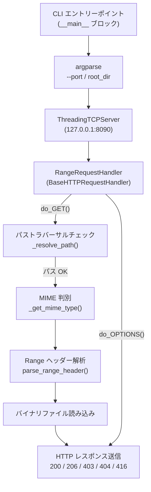

# Design Document: range_http_server

## Overview

`range_http_server.py` は、Piano Finger Tracker & Visualizer の検査用 Web ビューアが大容量の演奏動画（MP4 等）をシームレスにシーク再生できるよう、HTTP 206 Partial Content（RFC 7233）を完全実装したローカル HTTP サーバーである。

Python 標準ライブラリの `http.server.SimpleHTTPRequestHandler` は Range リクエストをサポートしないため、ブラウザの `<video>` 要素がシーク操作で先頭（0:00）にリセットされる問題がある。また Chromium の CORS/Origin 制約により `file://` プロトコルでは `createMediaElementSource` が無音化するため、`http://127.0.0.1:8090/` 経由での配信が必須となる。

本モジュールはサードパーティライブラリに一切依存せず、Python 3.11+ の標準ライブラリのみで以下を実現する：

- `Range: bytes=X-Y` リクエストへの `206 Partial Content` レスポンス
- CORS ヘッダー（`Access-Control-Allow-Origin: *`）と OPTIONS プリフライト対応
- 拡張子ベースの MIME タイプ自動判別
- パストラバーサル防止（`../` を含むパスの `403 Forbidden`）
- `--port` / ルートディレクトリの CLI 引数対応

---

## Architecture



### 処理フロー（do_GET）

1. リクエストパスを `urllib.parse.unquote` でデコード
2. `_resolve_path()` でルートディレクトリ外へのアクセスを検査（`403`）
3. ファイル存在確認（`404`）
4. `_get_mime_type()` で `Content-Type` 決定
5. `Range` ヘッダーの有無を確認
   - 無し → `200 OK` レスポンス（全体）
   - 有り → `parse_range_header()` で解析 → `206 Partial Content` または `416 Range Not Satisfiable`
6. ファイルをバイナリモードで開き、指定バイト範囲を読み込み送信

---

## Components and Interfaces

### `parse_range_header(header: str, file_size: int) -> tuple[int, int] | None`

Range ヘッダー文字列を解析し、`(start, end)` の整数タプルを返す純粋関数。

```python
def parse_range_header(header: str, file_size: int) -> tuple[int, int] | None:
    """
    Args:
        header:    "bytes=X-Y" または "bytes=X-" 形式の文字列
        file_size: 対象ファイルのバイト数

    Returns:
        (start, end) — 0-indexed inclusive byte range
        None          — ヘッダーが無効・解析不能（200 OK にフォールバック）

    Raises:
        RangeNotSatisfiable — 意味的に無効 (start >= file_size, start > end)
    """
```

| 入力パターン | 戻り値 |
|---|---|
| `bytes=100-199` | `(100, 199)` |
| `bytes=500-` | `(500, file_size - 1)` |
| `bytes=0-` | `(0, file_size - 1)` |
| `bytes=abc-def` | `None`（フォールバック: 200 OK） |
| `bytes=900-` (file_size=500) | `RangeNotSatisfiable` → `416` |
| `bytes=200-100` | `RangeNotSatisfiable` → `416` |

**設計の意図**: この関数を独立させることで、ネットワーク I/O なしに単体テスト・プロパティテストが可能になる。

---

### `RangeRequestHandler(BaseHTTPRequestHandler)`

`http.server.BaseHTTPRequestHandler` のサブクラス。

| メソッド | 責務 |
|---|---|
| `do_GET()` | パス解決 → MIME 判別 → Range 解析 → レスポンス送信 |
| `do_OPTIONS()` | CORS プリフライトへの `204 No Content` 応答 |
| `_resolve_path(url_path: str) -> Path \| None` | パストラバーサル検査、`None` = 403 |
| `_get_mime_type(path: Path) -> str` | 拡張子→ MIME 文字列 |
| `_send_full_response(path: Path, mime: str)` | `200 OK` レスポンス組み立て・送信 |
| `_send_partial_response(path: Path, mime: str, start: int, end: int, total: int)` | `206 Partial Content` レスポンス組み立て・送信 |
| `log_message(fmt, *args)` | UTF-8 対応ロギング（標準出力） |

---

### `RangeNotSatisfiable(Exception)`

Range が意味的に無効な場合に `parse_range_header()` 内部で送出される軽量な例外クラス。`do_GET()` でキャッチし `416` を返す。

---

### CLI エントリーポイント (`__main__`)

```
usage: python range_http_server.py [root_dir] [-p PORT]

positional arguments:
  root_dir        配信ルートディレクトリ (default: カレントディレクトリ)

options:
  -p, --port PORT TCPポート番号 1–65535 (default: 8090)
```

起動シーケンス：
1. `argparse` でポートとルートディレクトリを解析
2. ルートディレクトリの存在・ディレクトリ判定（失敗 → stderr + exit 1）
3. ポート範囲バリデーション（1–65535 外 → stderr + exit 1）
4. `ThreadingTCPServer(("127.0.0.1", port), RangeRequestHandler)` を生成
5. `stdout.reconfigure(encoding="utf-8")` で UTF-8 出力設定
6. `Serving on http://127.0.0.1:<port>` を stdout に出力
7. `serve_forever()` → `KeyboardInterrupt` で `server.shutdown()` を呼びシャットダウンログを出力

---

## Data Models

### レスポンスヘッダー構造

#### 200 OK（全体レスポンス）

```
HTTP/1.1 200 OK
Content-Type:   <mime_type>
Content-Length: <file_size>
Accept-Ranges:  bytes
Access-Control-Allow-Origin: *
```

#### 206 Partial Content

```
HTTP/1.1 206 Partial Content
Content-Type:   <mime_type>
Content-Length: <end - start + 1>
Content-Range:  bytes <start>-<end>/<file_size>
Accept-Ranges:  bytes
Access-Control-Allow-Origin: *
```

#### 416 Range Not Satisfiable

```
HTTP/1.1 416 Range Not Satisfiable
Content-Range:  bytes */<file_size>
Accept-Ranges:  bytes
Access-Control-Allow-Origin: *
Content-Length: 0
```

#### 204 No Content（OPTIONS プリフライト）

```
HTTP/1.1 204 No Content
Access-Control-Allow-Origin: *
Access-Control-Allow-Methods: GET, OPTIONS
Access-Control-Allow-Headers: Range
Access-Control-Max-Age: 86400
```

### MIME タイプマッピング

```python
MIME_MAP: dict[str, str] = {
    "mp4":  "video/mp4",
    "webm": "video/webm",
    "mp3":  "audio/mpeg",
    "wav":  "audio/wav",
    "json": "application/json",
    "html": "text/html; charset=utf-8",
    "js":   "application/javascript",
    "css":  "text/css",
}
# 上記にマッチしない場合: "application/octet-stream"
```

キーはすべて小文字。ファイル拡張子は `path.suffix.lstrip(".").lower()` で正規化してからルックアップする。

### `parse_range_header` の内部状態

```python
@dataclass
class RangeSpec:
    start: int   # 0-indexed inclusive
    end:   int   # 0-indexed inclusive
    total: int   # ファイルサイズ（bytes）

    @property
    def length(self) -> int:
        return self.end - self.start + 1
```

> **注**: `RangeSpec` は `parse_range_header()` の戻り値として使用するか、シンプルなタプル `(start, end)` に留めるかは実装者が判断してよい。設計上は `length` プロパティが Content-Length の計算ミスを防ぐため、`RangeSpec` の採用を推奨する。


---

## Correctness Properties

*A property is a characteristic or behavior that should hold true across all valid executions of a system — essentially, a formal statement about what the system should do. Properties serve as the bridge between human-readable specifications and machine-verifiable correctness guarantees.*

本機能は `parse_range_header()` や `_get_mime_type()` などの純粋関数、およびレスポンスヘッダー組み立てロジックを持つため、プロパティベーステスト（PBT）が適用可能である。

**Property Reflection（統合記録）:**
- 1.1 と 7.1 は「Range ヘッダーの解析ラウンドトリップ」として統合 → Property 1
- 1.2 と 7.2 は「オープンエンド Range の展開」として統合 → Property 2
- 1.4 と 7.5 は「Content-Range ヘッダーのフォーマット整合性」として統合 → Property 3
- 1.6 と 7.4 は「無効 Range → 416」として統合 → Property 4
- 2.3 と 3.1 は「MIME タイプのケースインセンシティブ判別」として統合 → Property 6

---

### Property 1: Range ヘッダーの解析ラウンドトリップ

*For any* file size `N > 0` and any pair of non-negative integers `(X, Y)` where `X <= Y < N`, parsing the Range header `"bytes=X-Y"` with file size `N` shall return exactly `(X, Y)` as `(start, end)`, and the computed `Content-Length` shall equal `Y - X + 1`.

**Validates: Requirements 1.1, 7.1**

---

### Property 2: オープンエンド Range の展開不変性

*For any* file size `N > 0` and any non-negative integer `X` where `X < N`, parsing the Range header `"bytes=X-"` with file size `N` shall return `(X, N - 1)` as `(start, end)`, and the computed `Content-Length` shall equal `N - X`.

（特殊ケース `X = 0` を含み、`bytes=0-` は常に `(0, N-1)` に展開される。）

**Validates: Requirements 1.2, 1.3, 7.2**

---

### Property 3: Content-Range ヘッダーのフォーマット整合性

*For any* valid byte range `(start, end)` with total file size `total`, the formatted `Content-Range` header string shall be exactly `"bytes {start}-{end}/{total}"`, and re-parsing that string shall recover the original `(start, end, total)` values without loss.

**Validates: Requirements 1.4, 7.5**

---

### Property 4: 意味的に無効な Range は常に 416 を返す

*For any* file size `N > 0`, and any integer `X >= N` (start が EOF 以降) または `X > Y`（start が end を超える）の Range ヘッダーに対して、`parse_range_header()` は常に `RangeNotSatisfiable` 例外を送出しなければならない。

**Validates: Requirements 1.6, 7.4**

---

### Property 5: 不正形式 Range ヘッダーは 200 OK にフォールバックする

*For any* string that does not match the pattern `bytes=\d*-\d*`（数字以外の文字、スペース、プレフィックス違いなど）、`parse_range_header()` は `None` を返し、呼び出し元は `200 OK` の全体レスポンスにフォールバックしなければならない。

**Validates: Requirements 7.3**

---

### Property 6: MIME タイプ判別のケースインセンシティブ不変性

*For any* file extension `ext` that maps to a defined MIME type, and *for any* case variation of that extension （例: `"MP4"`, `"Mp4"`, `"mP4"` はすべて `"mp4"` と同一扱い）, `_get_mime_type()` shall return the same MIME type string regardless of case.

**Validates: Requirements 2.3, 3.1**

---

### Property 7: CORS ヘッダーのユニバーサル付与

*For any* HTTP request that results in any response status code (200, 206, 403, 404, 416, etc.), the response shall always contain the header `Access-Control-Allow-Origin: *`.

**Validates: Requirements 4.1**

---

### Property 8: バイナリファイルのラウンドトリップ整合性

*For any* arbitrary byte sequence `B` of length `N` written to a file, requesting that file from the server (either as a full `200 OK` or as a `206 Partial Content` covering bytes `0` to `N-1`) shall return exactly `B` as the response body, with no modification, truncation, or encoding transformation.

**Validates: Requirements 6.4**

---

## Error Handling

### HTTP エラーレスポンス一覧

| 状態 | ステータスコード | 説明 |
|---|---|---|
| ファイルが存在しない | `404 Not Found` | リクエストパスのファイルが見つからない |
| パストラバーサル試行 | `403 Forbidden` | `../` 等でルートディレクトリ外に出ようとした |
| 無効 Range（semantic） | `416 Range Not Satisfiable` | start >= file_size または start > end |
| 無効 HTTP メソッド（OPTIONS） | `405 Method Not Allowed` | プリフライトで GET/OPTIONS 以外のメソッドが指定された |

全エラーレスポンスには `Access-Control-Allow-Origin: *` ヘッダーを付与する（Requirements 4.1）。

### 起動時エラー

| 条件 | 動作 |
|---|---|
| ポートが使用中 | `stderr` にエラーメッセージ、`exit(1)` |
| ルートディレクトリが存在しない or ディレクトリでない | `stderr` にエラーメッセージ、`exit(1)` |
| ポート番号が 1–65535 の範囲外 | `argparse` がエラー出力し `exit(2)` |

### `parse_range_header()` の例外処理

```
parse_range_header(header, file_size)
  ├─ header が None or パターン不一致    → return None      （200 OK フォールバック）
  ├─ start >= file_size                   → raise RangeNotSatisfiable  （416）
  ├─ start > end                          → raise RangeNotSatisfiable  （416）
  └─ 正常                                 → return RangeSpec(start, end, file_size)
```

### ファイル読み込みエラー

ファイルオープン・読み込み中に `OSError` が発生した場合は `500 Internal Server Error` を返す。ただし、本ツールはローカル専用のため通常は発生しない。

---

## Testing Strategy

### 使用するテストライブラリ

| 目的 | ライブラリ |
|---|---|
| プロパティベーステスト | [`hypothesis`](https://hypothesis.readthedocs.io/) (Python) |
| ユニットテスト・統合テスト | `pytest` |
| HTTP 統合テスト | `http.client` + `threading` でサーバーをインプロセス起動 |

> **注**: `hypothesis` は標準ライブラリ外だが、**テストコード専用**の依存であり、本体 `range_http_server.py` への依存ではないため Requirements 6.1 に違反しない。

### ユニットテスト（pytest + example-based）

`parse_range_header()` と `_get_mime_type()` は純粋関数なので直接テスト可能：

- **Range パーサー**:
  - `bytes=100-199` → `(100, 199)`, length=100
  - `bytes=0-` (file_size=1000) → `(0, 999)`, length=1000
  - `bytes=999-` (file_size=1000) → `(999, 999)`, length=1
  - `bytes=1000-` (file_size=1000) → `RangeNotSatisfiable`
  - `bytes=200-100` → `RangeNotSatisfiable`
  - `"invalid"` → `None`
- **MIME タイプ**:
  - 各拡張子（mp4, webm, mp3, wav, json, html, js, css）の正常マッピング
  - 大文字・混在ケース（`MP4`, `Json`）→ 同一 MIME
  - 未知拡張子・拡張子なし → `application/octet-stream`
- **パストラバーサル**:
  - `../../etc/passwd` → `None`（403）
  - 正常パス → `Path` オブジェクトを返す

### 統合テスト（pytest + インプロセス HTTP サーバー）

`threading.Thread` でサーバーを起動し `http.client.HTTPConnection` でリクエスト：

- **200 OK**: Range ヘッダーなし → 全体レスポンス、`Content-Length` 一致
- **206 Partial Content**: 有効な `Range: bytes=X-Y` → 指定バイト範囲のみ返却
- **416**: `Range: bytes=9999-` (小さいファイル) → ステータス確認
- **404**: 存在しないパス → 404 確認
- **403**: パストラバーサルパス → 403 確認
- **OPTIONS**: プリフライト → 204 + CORS ヘッダー確認
- **CORS**: 全レスポンスに `Access-Control-Allow-Origin: *` が含まれるか確認

### プロパティテスト（hypothesis）

各 Property に対し最低 100 イテレーション実行。タグ形式でトレーサビリティを確保：

```python
# Feature: range-http-server, Property 1: Range ヘッダーの解析ラウンドトリップ
@given(
    file_size=st.integers(min_value=1, max_value=10_000_000),
    start=st.integers(min_value=0),
    end=st.integers(min_value=0),
)
@settings(max_examples=200)
def test_property_1_range_parse_roundtrip(file_size, start, end):
    assume(start <= end < file_size)
    result = parse_range_header(f"bytes={start}-{end}", file_size)
    assert result is not None
    assert result.start == start
    assert result.end == end
    assert result.length == end - start + 1
```

```python
# Feature: range-http-server, Property 2: オープンエンド Range の展開不変性
@given(
    file_size=st.integers(min_value=1, max_value=10_000_000),
    start=st.integers(min_value=0),
)
@settings(max_examples=200)
def test_property_2_open_ended_range_expansion(file_size, start):
    assume(start < file_size)
    result = parse_range_header(f"bytes={start}-", file_size)
    assert result is not None
    assert result.start == start
    assert result.end == file_size - 1
    assert result.length == file_size - start
```

```python
# Feature: range-http-server, Property 4: 意味的に無効な Range は常に 416 を返す
@given(
    file_size=st.integers(min_value=1, max_value=10_000_000),
    start=st.integers(min_value=0),
)
@settings(max_examples=200)
def test_property_4_invalid_range_raises_416(file_size, start):
    assume(start >= file_size)
    with pytest.raises(RangeNotSatisfiable):
        parse_range_header(f"bytes={start}-", file_size)
```

```python
# Feature: range-http-server, Property 6: MIME タイプのケースインセンシティブ不変性
@given(
    ext=st.sampled_from(["mp4", "webm", "mp3", "wav", "json", "html", "js", "css"]),
    suffix=st.text(alphabet=string.ascii_letters, min_size=0, max_size=3),
)
@settings(max_examples=200)
def test_property_6_mime_case_insensitive(ext, suffix):
    # ランダムな大文字化パターン
    varied_ext = "".join(
        c.upper() if random.random() > 0.5 else c for c in ext
    )
    assert _get_mime_type(Path(f"file.{ext}")) == _get_mime_type(Path(f"file.{varied_ext}"))
```

### スモークテスト

- `python range_http_server.py --help` が終了コード 0 で完了
- `python range_http_server.py` が起動し `Serving on http://127.0.0.1:8090` を stdout に出力
- サードパーティ依存の不在確認（`pipdeptree` または `importlib.metadata` で検証）
